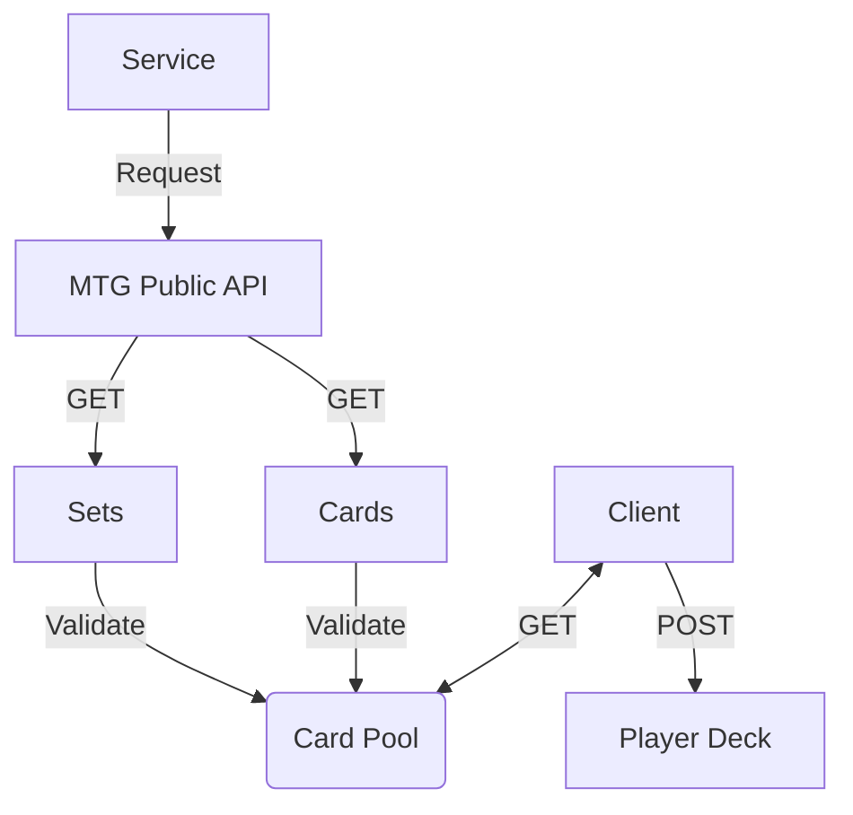

# WeatherDate Service
This service utilizes Magic: The Gathering API to create a web based game. 

## Magic: The Gathering API Details
The MTG APIs used relate to card data and set data. The official website for MTG API can be found here: https://magicthegathering.io/#. The official docs found in linked from above can be found here: https://docs.magicthegathering.io/. And the go SDK can be found here: https://github.com/MagicTheGathering/mtg-sdk-go. 

The go client is used:
    `go get github.com/MagicTheGathering/mtg-sdk-go`

## Example of magicTheGathering (this project) API Call
** TODO **
http://localhost:8111/v1/magic

## Magic: The Gathering How to Play
https://magic.wizards.com/en/how-to-play#ltp-video

## Run weatherWebApp
Checkout the git repo clesnar/go and rely on the .vscode config - run debug. Or build and run executable.
The default `host:port` is `localhost:8111`.
Once weatherWebApp is running, then in a browser, navigate to http://localhost:8111/v1/magic.

## debug build
go build -buildvcs=false -o /workspaces/clesnar-go/cmd/weatherWebApp/__debug_bin1800304272 -gcflags all=-N

## Flowcharts
### Building the Deck

